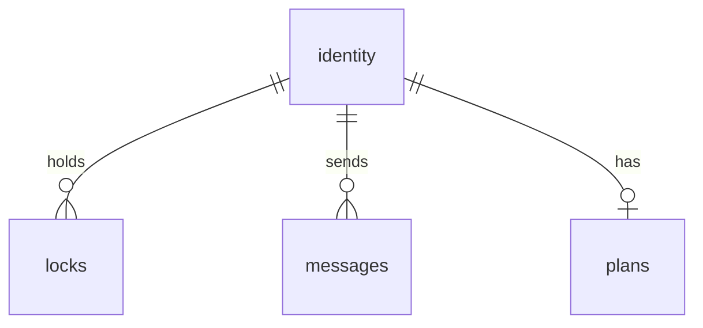

# Too Many Cooks - Multi-Agent Coordination MCP Server

CRITICAL: THERE IS ONLY ONE SERVER. IT SERVES BOTH MCP and ADMIN ROUTES.

## Overview

MCP server enabling multiple AI agents to safely edit a git repository simultaneously. Provides advisory file locking, agent identity, inter-agent messaging, plan visibility, and real-time event notifications.

**Location**: `examples/too-many-cooks/`

**Tech Stack**: TypeScript on Node.js, better-sqlite3, express, @modelcontextprotocol/sdk

> **Why TypeScript, not Dart?** The server was originally written in Dart compiled to JS via dart2js. We abandoned Dart because `dart:js_interop` made interop with Node.js libraries (better-sqlite3, express, MCP SDK) painful — every call required manual JSObject wrappers, type bridging was brittle, and debugging compiled JS was a nightmare. TypeScript gives us native access to the entire Node.js ecosystem with zero interop friction.

---

## Architecture

Single HTTP server per workspace. **Everything** talks to the server — agents via MCP Streamable HTTP, VSCode extension via admin REST + [HTTP STREAMABLE TRANSPORT](https://modelcontextprotocol.io/specification/2025-03-26/basic/transports#streamable-http). Nothing touches the DB directly except the server.

```mermaid
graph TD
    CC[Claude Code<br>MCP client] -->|MCP Streamable HTTP| MCP
    CL[Cline<br>MCP client] -->|MCP Streamable HTTP| MCP
    VSIX[VSCode Extension] -->|REST /admin/*| MCP

    MCP[Too Many Cooks Server<br>http://localhost:4040] -->|read/write| DB
    MCP -->|push events via [HTTP STREAMABLE TRANSPORT](https://modelcontextprotocol.io/specification/2025-03-26/basic/transports#streamable-http)| CC
    MCP -->|push events via [HTTP STREAMABLE TRANSPORT](https://modelcontextprotocol.io/specification/2025-03-26/basic/transports#streamable-http)| CL
    MCP -->|push events via [HTTP STREAMABLE TRANSPORT](https://modelcontextprotocol.io/specification/2025-03-26/basic/transports#streamable-http)| VSIX

    DB[(SQLite<br>.too_many_cooks/data.db)]
```

ONE HTTP server:
- **`/mcp`** — MCP Streamable HTTP endpoint for agents. Tool calls via POST, event stream via GET [HTTP STREAMABLE TRANSPORT](https://modelcontextprotocol.io/specification/2025-03-26/basic/transports#streamable-http).
- **`/admin/*`** — REST endpoints + [HTTP STREAMABLE TRANSPORT](https://modelcontextprotocol.io/specification/2025-03-26/basic/transports#streamable-http) event stream for the VSCode extension. Not exposed to MCP clients. VSIX receives all state changes via [HTTP STREAMABLE TRANSPORT](https://modelcontextprotocol.io/specification/2025-03-26/basic/transports#streamable-http) push — no polling.

**Database path**: `${workspaceFolder}/.too_many_cooks/data.db` 

**Transport**: Streamable HTTP with [HTTP STREAMABLE TRANSPORT](https://modelcontextprotocol.io/specification/2025-03-26/basic/transports#streamable-http). Server pushes events (new messages, lock changes, etc.) to all connected clients (agents + VSIX) in real-time. No polling anywhere.

**Why HTTP, not stdio**: Stdio spawns an isolated process per agent — agents can't see each other's events. HTTP gives one shared process where the notification emitter actually works across all connected agents.

---

## Database Schema



| Table | Columns |
|-------|---------|
| identity | agent_name (PK), agent_key, active (boolean), registered_at, last_active |
| locks | file_path (PK), agent_name (FK), acquired_at, expires_at, reason, version |
| messages | id (PK), from_agent (FK), to_agent, content, created_at, read_at |
| plans | agent_name (PK/FK), goal, current_task, updated_at |

---

## MCP Tools

### `register`
Register or reconnect an agent. Sets session identity for the connection.
- **First call**: `{ name }` only (1-50 chars) — creates agent, returns key ONLY once — store it!
- **Reconnect**: `{ key }` only — server looks up the agent name from the key. Specifying both `name` and `key` is an error.
- Output: `{ agent_name, agent_key }`

### `lock`
Advisory file locks.
- Actions: `acquire`, `release`, `force_release`, `renew`, `query`, `list`
- `acquire/release/renew`: uses session identity + file_path
- `force_release`: only works on expired locks
- `query/list`: no auth required

### `message`
Inter-agent messaging.
- Actions: `send`, `get`, `mark_read`
- `send`: requires to_agent, content (`maxLength: 200`). Use `*` for broadcast.
- `get`: returns messages (unread_only defaults true)

### `plan`
Agent plans (what you're doing and why).
- Actions: `update`, `get`, `list`
- `update`: uses session identity + goal, current_task (`maxLength: 100` each)
- `get/list`: no auth required

### `status`
System overview: agents, locks, plans, recent messages. No auth required.

---

## Real-Time Agent Notifications (CRITICAL)

**EVERY connected agent MUST receive real-time streamed notifications when state changes.** This is the entire point of the server. Agents do NOT poll — the server PUSHES events to them via MCP logging notifications over Streamable HTTP.

### What agents receive in real-time

When ANY of the following happen, the server IMMEDIATELY pushes an MCP `notifications/message` (logging notification) to EVERY connected agent's Streamable HTTP session:

| Event | Trigger | Why agents need it |
|-------|---------|-------------------|
| `message_sent` | Any agent sends a message (including broadcasts) | **Agents must know when they have new messages — they cannot poll** |
| `agent_registered` | A new agent registers | Agents must know who else is working on the codebase |
| `agent_activated` | An agent reconnects | Agents must know who is currently online |
| `agent_deactivated` | An agent disconnects | Agents must know who went offline |
| `lock_acquired` | Any agent acquires a file lock | Agents must know which files are locked before editing |
| `lock_released` | Any agent releases a file lock | Agents must know when files become available |
| `lock_renewed` | Any agent renews a lock | Agents must know lock state changes |
| `plan_updated` | Any agent updates their plan | Agents must coordinate work |

### How it works (implementation)

The server maintains an **agent event hub** — a registry of all connected agent McpServer instances. When any tool handler modifies state, the notification emitter pushes a logging notification to EVERY registered agent server (with a 50ms delay to avoid racing with the tool-call HTTP response on the same session).

Wire format (MCP JSON-RPC notification over SSE):
```json
{
  "jsonrpc": "2.0",
  "method": "notifications/message",
  "params": {
    "level": "info",
    "logger": "too-many-cooks",
    "data": {
      "event": "message_sent",
      "timestamp": 1700000000000,
      "payload": {
        "message_id": "msg123",
        "from_agent": "agent1",
        "to_agent": "agent2",
        "content": "Hello"
      }
    }
  }
}
```

### NO POLLING. EVER.

Agents do NOT need to call `message get` on a timer. They do NOT need to call `status` repeatedly. The server pushes all state changes to them in real-time. If an agent is connected, it WILL receive every event.

---

## Connection Lifecycle & Active Agents

There is **no subscribe tool**. Subscriptions are automatic — managed entirely by the server based on connection state.

### How it works

1. **First connection** — agent calls `register` with just `name` → server creates identity, returns key, marks agent **active**, opens [HTTP STREAMABLE TRANSPORT](https://modelcontextprotocol.io/specification/2025-03-26/basic/transports#streamable-http) event stream. **The agent must store this key.**
2. **While connected** — server pushes all relevant events (lock changes, messages, plan updates, agent status changes) to the agent via [HTTP STREAMABLE TRANSPORT](https://modelcontextprotocol.io/specification/2025-03-26/basic/transports#streamable-http) automatically. **This is not optional — it is the core mechanism.**
3. **Connection drops** (agent disconnects, crashes, network loss) → server immediately marks agent as **deactivated** in the DB and emits `agent_deactivated` to all remaining connections (agents + VSIX)
4. **Reconnect** — agent calls `register` with `key` only → server looks up the agent name from the key, marks agent **active** again, emits `agent_activated`. No new key is issued — the original key remains valid. Specifying `name` on reconnect is an error.

### Active agents in the DB

The `identity` table tracks connection state via an `active` column. The set of active agents **always matches** the set of agents with live [HTTP STREAMABLE TRANSPORT](https://modelcontextprotocol.io/specification/2025-03-26/basic/transports#streamable-http) connections. This is the single source of truth — the VSIX reads it to show which agents are online.

### VSIX behavior

The VSIX connects to `/admin/events` ([HTTP STREAMABLE TRANSPORT](https://modelcontextprotocol.io/specification/2025-03-26/basic/transports#streamable-http)) on startup and receives the same event stream as agents. When an `agent_deactivated` event arrives, the VSIX immediately reflects this in the tree view (greyed out, offline indicator, etc.). No polling — the VSIX is purely reactive to push events.

---

## Session Identity

After calling `register`, the server stores the agent's name and key in per-connection session state. Subsequent tool calls (lock, message, plan) use the session identity automatically — agents don't pass `agent_name`/`agent_key` on every call.

---

## Admin REST Endpoints

Admin operations are exposed as REST endpoints on the server, **not** as MCP tools. Only the VSCode extension hits these. Agents cannot access them.

| Endpoint | Method | Body | Description |
|----------|--------|------|-------------|
| `/admin/delete-lock` | POST | `{ filePath }` | Force-delete a lock |
| `/admin/delete-agent` | POST | `{ agentName }` | Delete agent and all associated data |
| `/admin/reset-key` | POST | `{ agentName }` | Generate new key for agent |
| `/admin/send-message` | POST | `{ fromAgent, toAgent, content }` | Send message on behalf of agent (no auth) |
| `/admin/status` | GET | — | Full status (agents, locks, messages, plans) |
| `/admin/events` | GET ([HTTP STREAMABLE TRANSPORT](https://modelcontextprotocol.io/specification/2025-03-26/basic/transports#streamable-http)) | — | [HTTP STREAMABLE TRANSPORT](https://modelcontextprotocol.io/specification/2025-03-26/basic/transports#streamable-http) stream pushing all state changes to the VSIX in real-time |

---

## Package Structure

| Package | Role |
|---------|------|

| `too-many-cooks/` | HTTP server. MCP endpoint for agents, admin REST endpoints for VSIX, event notifications. |
| `too_many_cooks_vscode_extension/` | VSCode extension. Talks to server via `/admin/*` REST endpoints. Receives all state changes via [HTTP STREAMABLE TRANSPORT](https://modelcontextprotocol.io/specification/2025-03-26/basic/transports#streamable-http) push. Tree views for agents, locks, messages, plans. |

---

## Key Behaviors

1. **Session auth**: Register (name only) or reconnect (key only) per connection, session identity used for all subsequent calls
2. **Lock expiry**: Any agent can force_release expired locks
3. **Optimistic concurrency**: Version column on locks prevents races
4. **Retry policy**: 3 attempts, exponential backoff for transient SQLite errors
5. **Broadcast messages**: Use `*` as to_agent
6. **Real-time events**: Server pushes notifications to all connected agents and the VSIX via [HTTP STREAMABLE TRANSPORT](https://modelcontextprotocol.io/specification/2025-03-26/basic/transports#streamable-http) — no polling

---

## Defaults

| Setting | Value |
|---------|-------|
| Lock timeout | 600000ms (10 min) |
| Max message length | 200 chars |
| Max plan field length | 100 chars |
| Retry attempts | 3 |
| Base retry delay | 50ms |

---

## Testing

Black-box, end-to-end tests. Interact via MCP protocol (HTTP) or VSCode UI, verify results. No mocking internals.

| Test suite | Location |
|------------|----------|
| Data layer | `too-many-cooks/test/` |
| MCP server (integration) | `too-many-cooks/test/` |
| Tool schemas | `too-many-cooks/test/tool_schemas_test.ts` |
| VSCode extension | `too_many_cooks_vscode_extension/test/suite/` |
